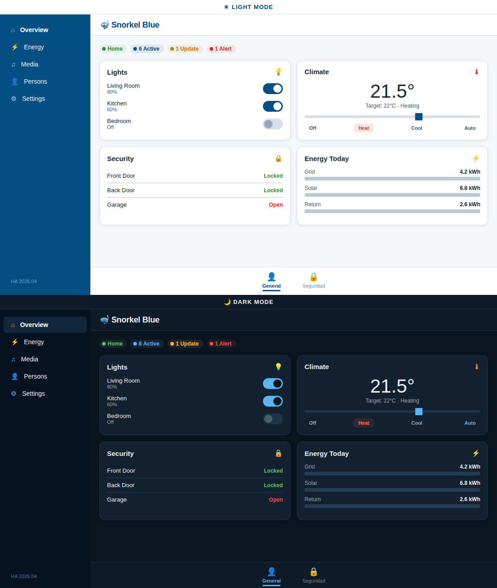

# 🤿 Snorkel Blue — Home Assistant Theme

A carefully crafted theme for Home Assistant based on **Pantone 19-4049 TCX "Snorkel Blue"** (`#034F84`), featuring both light and dark modes with full **WCAG AA+ accessibility compliance**.



## Features

- **Dual mode**: Light and dark variants, switchable from user profile
- **WCAG AA+ compliant**: All text/icon/UI contrast pairs validated ≥ 3:1 (UI) / ≥ 4.5:1 (text)
- **Complete coverage**: 136+ variables per mode — cards, sidebar, header, switches, sliders, inputs, dialogs, code editor, energy dashboard, and all semantic entity states
- **2026.04 ready**: Includes the new `ha-color-form-background` semantic variables, `ha-view-sections-row-gap`, and Material Design 3 system color tokens
- **Shoelace compatible**: Includes `sl-color-primary-600`, `ha-tab-active-text-color`, and related variables for proper tab rendering (2025.5+)
- **No dependencies**: Works standalone, no card-mod required
- **Energy dashboard colors**: Tuned for readability on both modes

## Color Palette

| Role | Light Mode | Dark Mode |
|------|-----------|-----------|
| Primary | `#034F84` Snorkel Blue | `#5BB3F0` Sky Blue |
| Accent | `#B87408` Warm Gold | `#F3A724` Amber |
| Background | `#F5F8FB` Ice | `#0A1520` Deep Sea |
| Card | `#FFFFFF` White | `#122030` Midnight |
| Text | `#1A2A3A` Ink | `#E8EDF2` Mist |
| Header | `#FFFFFF` White | `#0E1A28` Deep Navy |
| Sidebar | `#034F84` Snorkel Blue | `#071220` Abyss |

## Installation

### HACS (recommended)

1. Open HACS → ⋮ menu → **Custom repositories**
2. Paste the URL of this repository
3. Select category: **Theme**
4. Click **Add**, then install
5. Restart Home Assistant
6. Go to your **Profile** → select **Snorkel Blue**

### Manual

1. Copy `themes/snorkel_blue.yaml` into your HA `config/themes/` folder
2. Ensure your `configuration.yaml` contains:
   ```yaml
   frontend:
     themes: !include_dir_merge_named themes
   ```
3. Restart Home Assistant

## Compatibility

- **Home Assistant**: 2026.04+
- **Frontend**: Shoelace components (2025.5+) and Material Design 3 tokens
- **Companion Apps**: iOS and Android (auto-syncs theme)

## License

MIT
